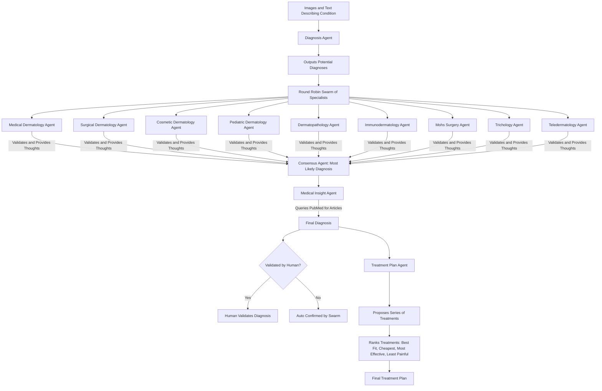

# DermaSwarm: A Production-Grade Multi-Agent Dermatology Swarm

[](https://discord.gg/agora-999382051935506503) [](https://www.youtube.com/@kyegomez3242) [](https://www.linkedin.com/in/kye-g-38759a207/) [](https://x.com/kyegomezb)


[](https://badge.fury.io/py/dermaswarm)
[](https://github.com/The-Swarm-Corporation/DermaSwarm/blob/main/LICENSE)


**DermaSwarm** is a production-grade multi-agent system designed for dermatologists to collaboratively diagnose and treat skin conditions. Leveraging the power of AI-driven agents, DermaSwarm cross-checks peer-reviewed dermatology research to ensure diagnosis accuracy, generates treatment plans, and outputs results in easy-to-use JSON format. With extensive logging, seamless collaboration between agents, and a focus on clinical reliability, DermaSwarm is built for real-world use by dermatology practitioners.

## Installation

You can install **DermaSwarm** via pip:

```bash
pip install -U dermaswarm
```

## Features

- **Multi-Agent Collaboration**: Leverage multiple AI agents specialized in dermatology to analyze symptoms, suggest diagnoses, and validate findings against peer-reviewed literature.
- **Evidence-Based Diagnoses**: Each diagnosis is cross-referenced with peer-reviewed articles to ensure accuracy and up-to-date knowledge.
- **Personalized Treatment Plans**: Based on the diagnosis, DermaSwarm generates a personalized treatment plan for the patient.
- **JSON Output**: Structured outputs in JSON format, including diagnosis, references, and suggested treatments for easy integration into medical records.
- **Comprehensive Logging**: Track the entire diagnostic process with extensive logging to ensure transparency and traceability of agent actions.
- **API-Ready**: Easy to integrate with existing dermatology workflows and applications.


## Architecture



## Usage

Below is an example of how to use **DermaSwarm** in a typical dermatological workflow.

### Example


### Logging

**DermaSwarm** includes comprehensive logging powered by `loguru` to track agent decisions, references to peer-reviewed articles, and diagnostic conclusions. You can configure the logging settings to fit your clinic’s compliance and documentation needs.

```python
from dermaswarm import configure_logging

# Configure logging
configure_logging(level="INFO", log_file="diagnosis_logs.log")
```

## API Integration

DermaSwarm can be easily integrated into any clinical software via its REST API interface. Below is an example request using cURL:

```bash
curl -X POST https://api.dermaswarm.com/diagnose \
-H "Content-Type: application/json" \
-d '{
  "symptoms": {
    "rash": "red, scaly patches",
    "location": "forearm",
    "duration": "2 weeks",
    "itchiness": "severe"
  },
  "medical_history": {
    "allergies": ["pollen"],
    "current_medications": ["ibuprofen"]
  }
}'
```

### API Response

```json
{
  "diagnosis": "Psoriasis",
  "treatment_plan": {
    "medications": [
      {
        "name": "Topical Corticosteroids",
        "dosage": "Apply twice daily for 2 weeks"
      }
    ],
    "follow_up": "Reassess in 4 weeks for symptom improvement"
  },
  "peer_reviewed_articles": [
    {
      "title": "Psoriasis and Its Treatment",
      "journal": "Journal of Dermatology",
      "url": "https://example.com/psoriasis-article"
    }
  ]
}
```

## Configuration

DermaSwarm offers flexible configuration options to tailor the system to your practice:

```python
from dermaswarm import set_config

set_config({
    "peer_review_check": True, 
    "output_format": "json", 
    "log_level": "INFO"
})
```

## Roadmap

- **Enhanced Treatment Plans**: Addition of more diverse treatment recommendations, including alternative therapies.
- **Multi-Language Support**: Expanding the language capabilities to support non-English-speaking regions.
- **Cloud Integration**: Upcoming support for cloud-based deployments with added security and scalability.
- **Mobile App Integration**: Seamless mobile interface for real-time diagnostics on-the-go.

## Contributing

We welcome contributions from the community! Please see our [CONTRIBUTING.md](https://github.com/The-Swarm-Corporation/DermaSwarm/blob/main/CONTRIBUTING.md) for more details.

## License

DermaSwarm is open-source software, licensed under the [MIT License](https://github.com/The-Swarm-Corporation/DermaSwarm/blob/main/LICENSE).
